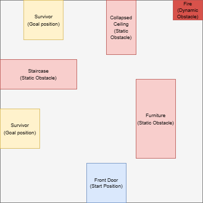
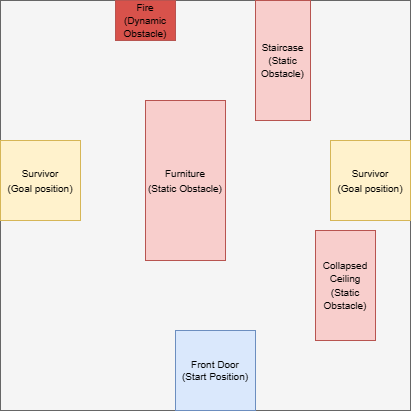
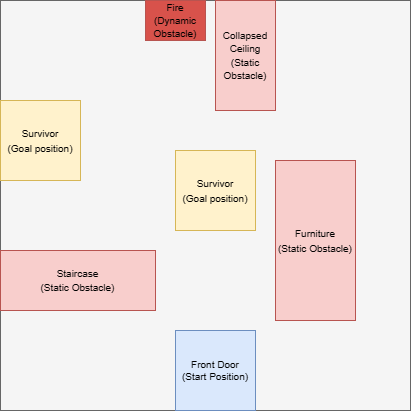
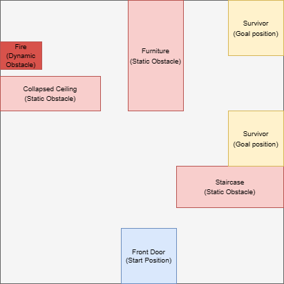
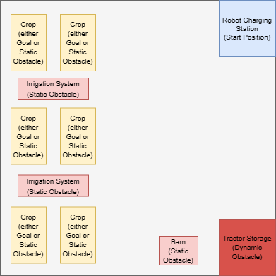
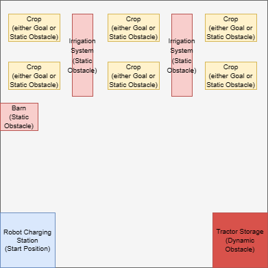
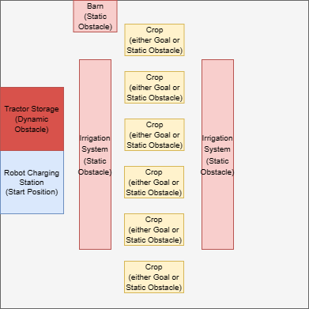
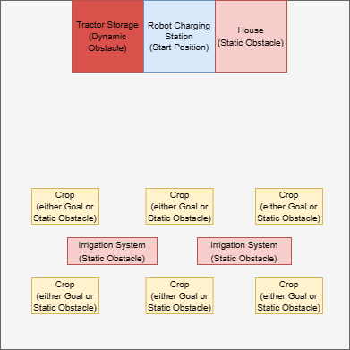

# A Fork of Multi-Agent Particle Environment

Signal8 is an enhanced version of the Simple environment, originally developed by the [Farama Foundation](https://farama.org/) as part of their [Multi-Agent Particle Environment (MPE)](https://pettingzoo.farama.org/environments/mpe/).

# Signal8

Signal8 is an open-source research project that provides a robust environment for the development and evaluation of communication strategies in multi-agent systems. The project introduces a dynamic environment inspired by real-world scenarios, including disaster response and precision farming. This environment extends the principles of the Lewis signaling game to create an enriched testing ground for advanced robot-to-robot communication solutions.

Each problem type in Signal8 comprises four distinct scenarios, each presenting unique constraints on where entities such as start and goal points, as well as static and dynamic obstacles, can be instantiated. This dynamism allows for extensive testing of the communication strategies under varied circumstances, making the environment realistic and versatile.

A key feature of Signal8 is the asymmetric information structure inherent to the environment. Two types of agents operate within this structure - an 'eye in the sky' agent possessing global information, and ground agents equipped with only local information. This asymmetry creates a scenario akin to real-world situations, presenting challenges for the development of efficient communication methods while also offering exciting opportunities for the creation of context-dependent language and high-level directives.

For more information on how to use the env API, visit [here](https://pettingzoo.farama.org/content/basic_usage/).

## Installation

```
git clone https://github.com/ethanmclark1/signal8.git
cd signal8
pip install -r requirements.txt
pip install -e .
```

## Usage

```
import Signal8

env = Signal8.env(problem_type='disaster_response')
env.reset(options={"instance_num": 0}))
observation, _, terminations, truncations, _ = env.last()
env.step(action)
env.close()
```

## List of Problem Scenarios

|   Problem Type   | Scenario Name |                 Visualization                 |
| :---------------: | :------------: | :--------------------------------------------: |
| Disaster Response | ``Scenario 0`` |  |
| Disaster Response | ``Scenario 1`` |  |
| Disaster Response | ``Scenario 2`` |  |
| Disaster Response | ``Scenario 3`` |  |
| Precision Farming | ``Scenario 0`` |  |
| Precision Farming | ``Scenario 1`` |  |
| Precision Farming | ``Scenario 2`` |  |
| Precision Farming | ``Scenario 3`` |  |

Each of the colored regions represents an area where the respective entity can be instantiated. Blue regions are starting regions, yellow regions represent regions possible goal regions and in the case of precision farming, if a goal region is not generated in the yellow region then changes to a static obstacle region but this is not the case for disaster response, instead the region where the goal was not instantiated does not impact the episode at all, the light red regions represent static obstacles, and dark red regions represent dynamic obstacles.

In the case of disaster response, the dynamic obstacle does not move, instead it incrementally increases the obstacle radius to simulate a fire. In the precision farming case, the dynamic obstacle represents the behavior of a hockey rink ice cleaner moving in zig zags. 

## Paper Citation

If you used this environment for your experiments or found it helpful, consider citing the following papers:

Environments in this repo:

<pre>
@article{lowe2017multi,
  title={Multi-Agent Actor-Critic for Mixed Cooperative-Competitive Environments},
  author={Lowe, Ryan and Wu, Yi and Tamar, Aviv and Harb, Jean and Abbeel, Pieter and Mordatch, Igor},
  journal={Neural Information Processing Systems (NIPS)},
  year={2017}
}
</pre>

Original particle world environment:

<pre>
@article{mordatch2017emergence,
  title={Emergence of Grounded Compositional Language in Multi-Agent Populations},
  author={Mordatch, Igor and Abbeel, Pieter},
  journal={arXiv preprint arXiv:1703.04908},
  year={2017}
}
</pre>
